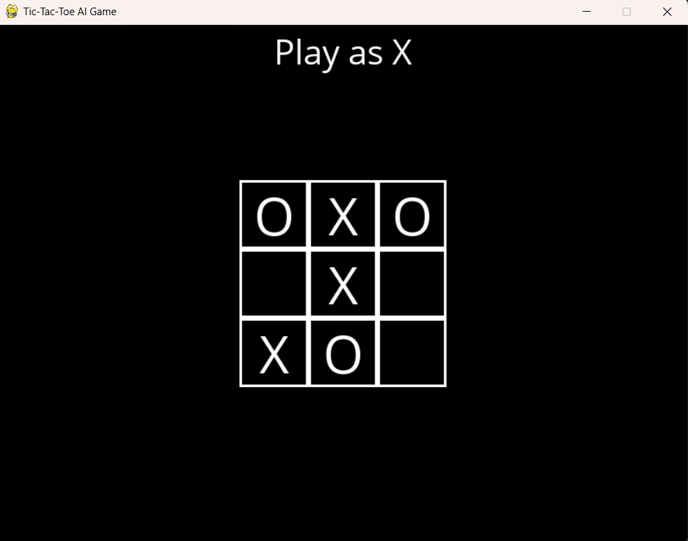
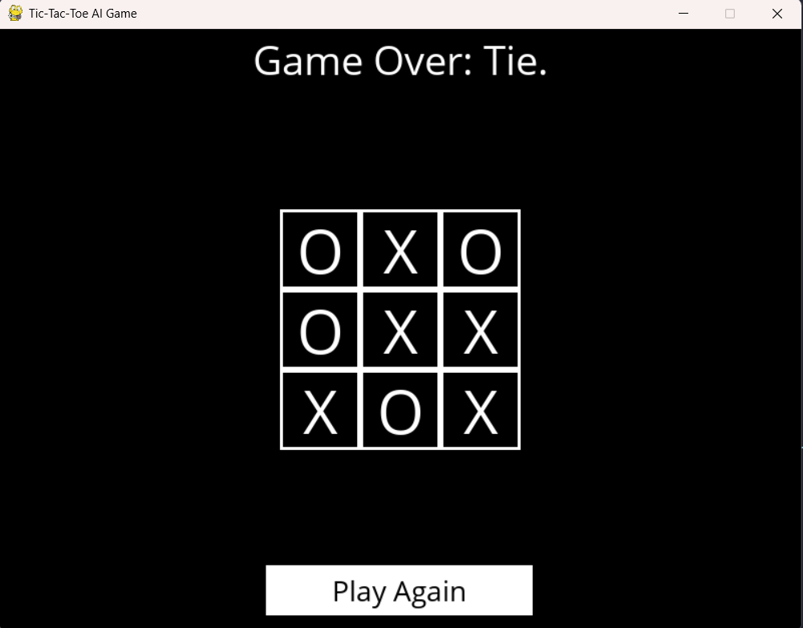

# Tic-Tac-Toe AI Game 

This is a graphical implementation of the classic Tic-Tac-Toe game where a user can play against an AI opponent powered by the Minimax algorithm with alpha-beta pruning.

## Features

- User-friendly graphical interface using Pygame
- Option to play as 'X' or 'O'
- Smart AI opponent using Minimax strategy
- Real-time interaction and game state updates
- Displays game outcome (win/lose/tie) and offers replay option

## Technologies Used

- **Python 3**
- **Pygame** for rendering graphics and managing user input
- **Minimax Algorithm** with **Alpha-Beta Pruning** for AI decisions

## Files

- `tictactoe.py`: Contains the game logic, including the board state, rules, and Minimax AI.
- `runner.py`: Initializes and runs the Pygame window, handles user interaction and gameplay.

## Getting Started

### Prerequisites

- Python 3.x installed
- Pygame installed:  
  ```
  pip install pygame
  ```

### How to Run

1. Make sure both `runner.py` and `tictactoe.py` are in the same directory.
2. Run the game:
   ```
   python runner.py
   ```
3. Choose your player ('X' or 'O') and start playing!

## Screenshots




## License

This project is open-source and free to use for learning or extension purposes.
